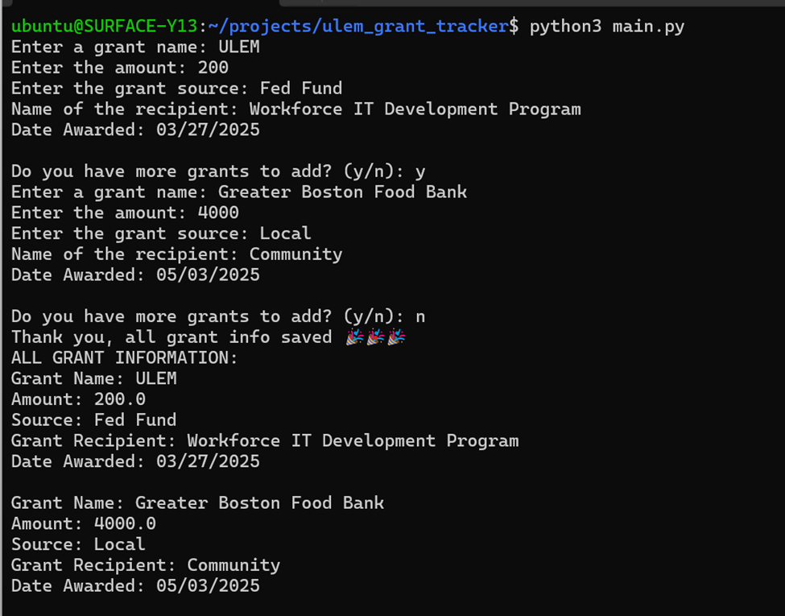
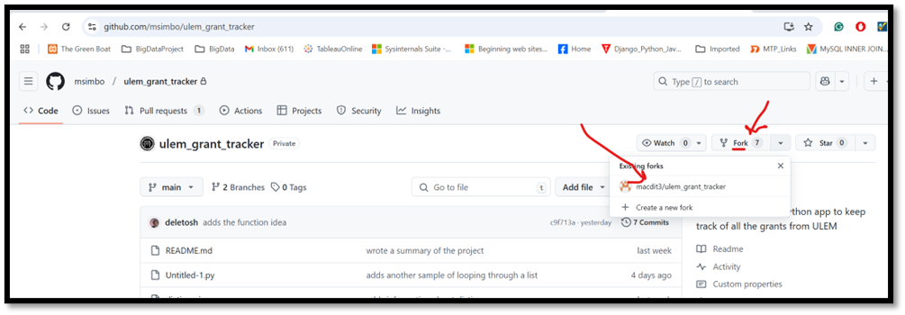
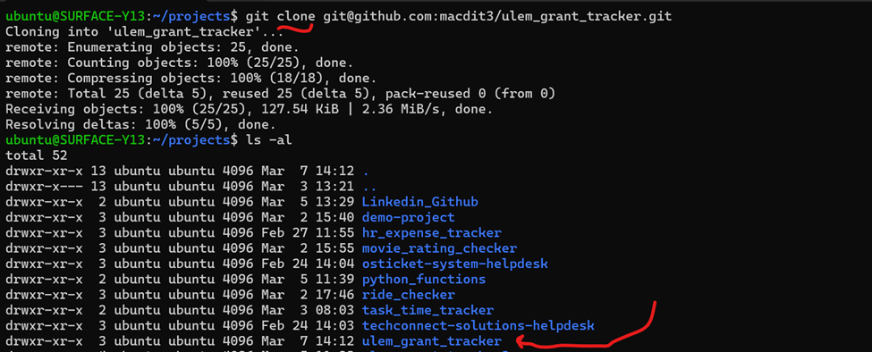
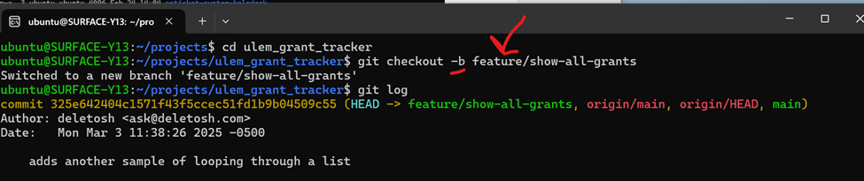
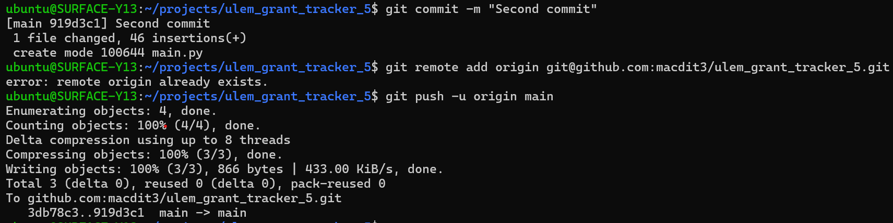

# ULEM Grant Tracker 
This application facilitates the acquisition of grant-related information through user interface prompts, subsequently maintains said information in data storage, and ultimately renders a comprehensive display of all recorded grant particulars via the console output mechanism.

## Table of Contents
- [Features](#features)
- [Getting Started](#getting-started)
- [Prerequisites](#prerequisites)
- [Installation](#installation)
- [Usage](#usage)
- [Contributing](#contributing)
- [Testing](#testing)
- [Deployment](#deployment)
- [Acknowledgments](#acknowledgments)

## Features
- The system shall extend a welcome to the user and subsequently request grant-related information.
- The collected grant information shall be stored in dictionary structures within a list data type.
- Upon completion of data entry, the system shall display a comprehensive presentation of all stored grant information via the console interface.

## Getting Started
Instructions on setting up your project locally.
- Translate the business requirements into technical requirements
- Algorithm for the program written - instrucitons/step-by-step
- Implementation and finally testing.


### Prerequisites
- Python Program Interpreter: Download and Install it:https://www.python.org/downloads/
- IDE: download and install any IDE, in this project, Microsoft VS Code is used: https://code.visualstudio.com/download

### Installation
   ```bash
   $ git clone git@github.com:macdit3/ulem_grant_tracker_5.git
   ```


## Usage
This progrma can be executed on the console using: assuming that you aleady cloned the project from the github and working inside the project directory.

 ```bash
   $ python3 main.py
   ```



## Contributing
1. Fork the Project: Go to: https://github.com/msimbo/ulem_grant_tracker


- Clone the project to your local host


2. Create your Feature Branch (`git checkout -b feature/AmazingFeature`)
3. Commit your Changes (`git commit -m 'Add some AmazingFeature'`)




4. Push to the Branch (`git push origin feature/AmazingFeature`)

 

5. Open a Pull Request

## Testing
Explain how to run the automated tests:


```

## Deployment
You can view this simple app online via pythoneverywhere portal.
https://www.pythonanywhere.com/user/macueidit3/shares/48a864e19d1b425cbc09bb66684f8213/


## Acknowledgments
* This project is part of the MA Workforce IT Development Program
